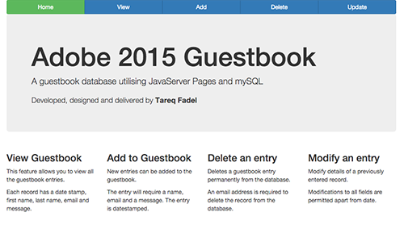
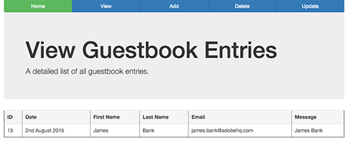
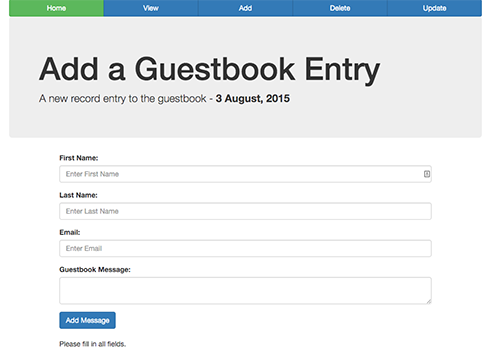
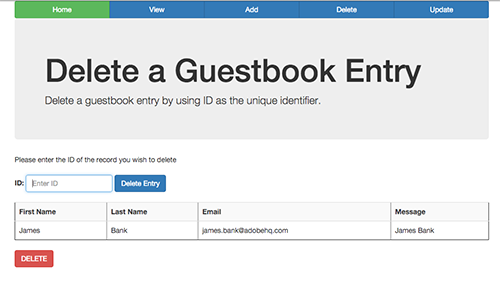
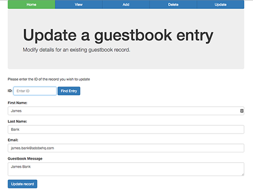

# JavaServer Pages Guestbook

A sample guestbook application built in JavaServer Pages (JSP) and utilises
MySQL as the database.

The guestbook application allows the user to:

* View all records in the database
* Add a record
* Delete a record
* Update an existing record.

# Frameworks used
* [Bootstrap](http://getbootstrap.com/)
* [jQuery](https://jquery.com/)
* [jQuery-dateFormat](https://github.com/phstc/jquery-dateFormat)

The database has the following fields
* Id AutoIncrement
* FirstName
* LastName
* Date
* Message
* Email

# Screenshots

